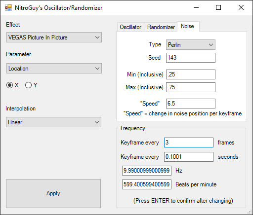

# Vegas_Oscillator_Randomizer
An oscillator/randomizer script/plugin for MAGIX VEGAS Pro 18 (although it should also work on previous versions)

This plugin automates the animation of a certain parameter of any OpenFX-based video effect.
A parameter can oscillate, be set to random values, or traverse through noise generated by [FastNoiseLite](https://github.com/Auburn/FastNoiseLite).

## Install

Grab the latest .exe binary from the [releases tab](https://github.com/NitroGuy10/Vegas_Oscillator_Randomizer/releases/latest).
Move the .exe file into the Script Menu folder of your VEGAS installation.
Usually, it's something like C:\\Program Files\\VEGAS\\VEGAS Pro 18.0\\Script Menu

From Vegas, you can find it under Tools > Scripting > OscillatorRandomizer

You can also add it to your toolbar by double-clicking on the toolbar, choosing ChromaticAberration from the left menu, and clicking "Add ->".
